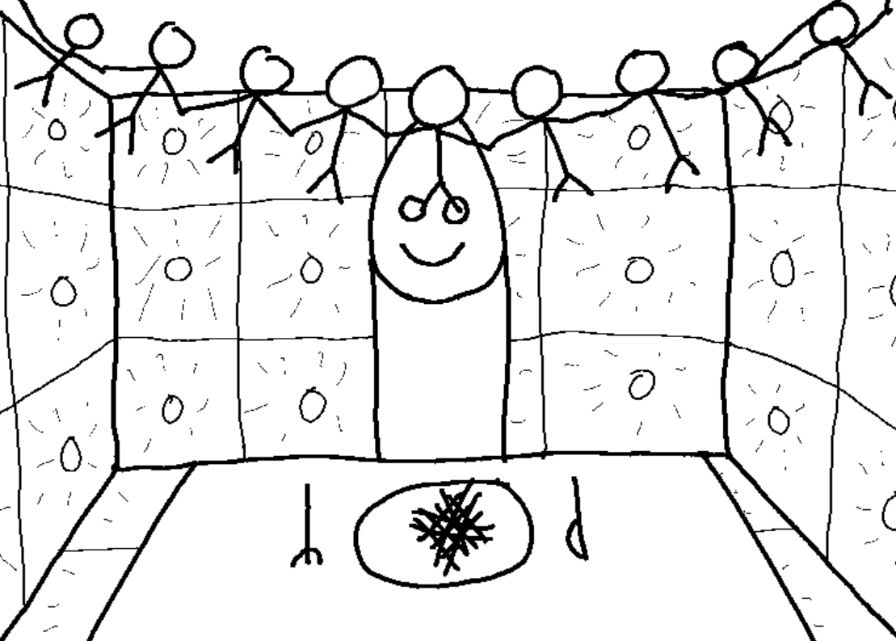

# Programming assignment 03

### Jebediah the Curious

## Problem description

Jebediah is an ambitious computer science student. He has recently took an interest in digital encryption and identity varification. Many of these algorithms use hashfunctions. A hash function is a function which (alike many others) takes an imput, and generates an output. The unique quality of hash functions is that it is impossible to determine from the output what the input must have been. As such, Jebediah decided he wanted to implement one himself. The algorithm he has decided he wants to use is a rather simple one, and ill suited for serious cryptographic pursuits, but it's a good place
to start.

Jebediah has a problem, however. He needs either a **Linked List** or a **Doubly Linked List** to complete this hash function. You may think Jebediah's goal is attainable without one, but it actually isn't and he will dock you points if you try to go against his hypothesis.

Implement either a **Linked List** or a **Doubly Linked List** by creating a file called **MyList.hpp**. Look in **MyList.h** for function prototypes that you will implement in **MyList.hpp**. If you want to make your Linked List a Doubly Linked List, simply uncomment the previous node pointer in the ListNode class in **MyList.h**. Do NOT modify anything else in **MyList.h**.

### Inputs

The input will simply consist of lines of integers. There will be one nonegative integer per line and you can assume the integer will have less than a thousand digits.

Example input:

1527 
1234 
8888 
592774836483

### Outputs

Output, like input, should just consist of lines of integers. Each output line should correspond to the input line, where the outputted line is all of the digits of the input integer added together.

Example output:

15 
10 
32 
66

### Code specifications

Instead, leave that job for main.

## Git autograding 
Git clone your repository onto your machine, and run the autograder.
See: [docs/git_autograding.md](docs/git_autograding.md)

